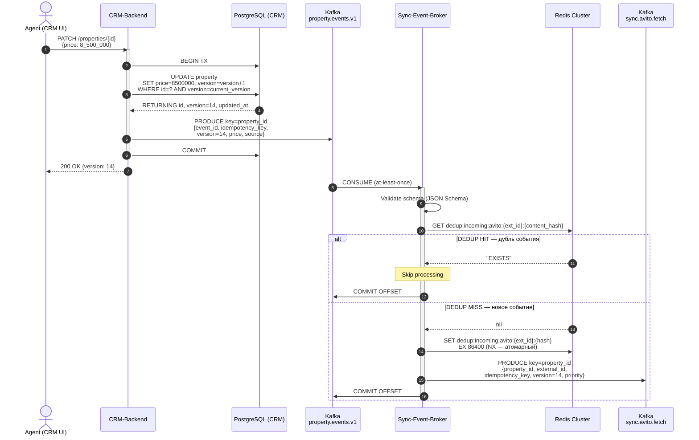
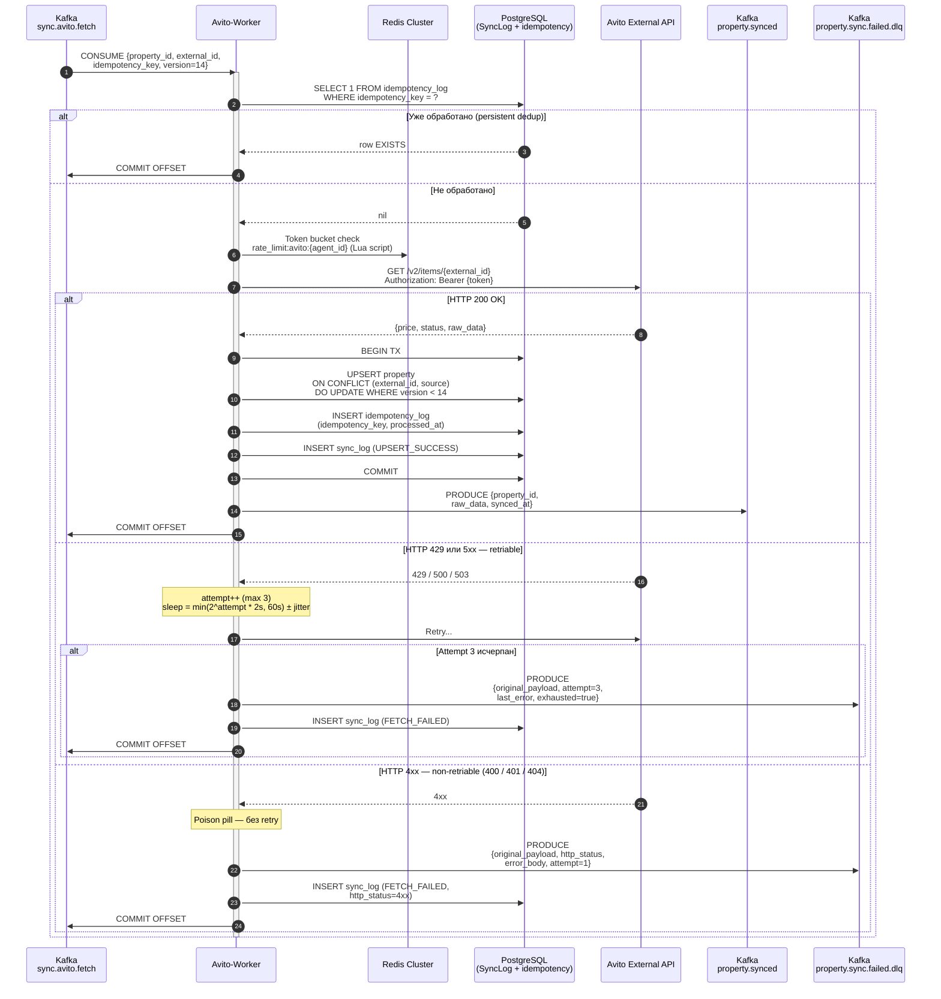

# System Architecture & Integration Specification
## Async Property Sync & Scoring Module — Part I

> **Document type**: Technical Specification v0.1-draft  
> **Domain**: Real Estate CRM — External Aggregator Integration  
> **Scope**: Message contract, fault-tolerance strategy, idempotency & race condition handling  
> **Audience**: Engineering Team, Tech Lead Review

---

## 1. Архитектурные схемы взаимодействия

### Диаграмма 1 — Генерация события и дедупликация на брокере

> Scope: от `PATCH /properties` агента до публикации в `sync.avito.fetch`



---

### Диаграмма 2 — Обработка воркером и интеграция с Avito API

> Scope: от чтения из `sync.avito.fetch` до UPSERT в БД / ухода в DLQ



---

## 2. Спецификация контракта сообщения (Message Payload)

### Topic: `property.events.v1`
**Partition key**: `property_id` (гарантирует causal ordering в рамках одного объекта)  
**Serialization**: JSON (v1), миграция на Avro/Protobuf в v2  
**Retention**: 7 дней / 50 GB per partition

### JSON Payload Example

```json
{
  "metadata": {
    "event_id": "01HXKP9Z2VQWRT3MXND5FB7EAC",
    "event_type": "property.price_updated",
    "schema_version": "1.2.0",
    "idempotency_key": "agent:7f3c1a2b-prop:e4d5f6a7-v:14-ts:1716307200000",
    "timestamp": "2024-05-21T12:00:01.543Z",
    "actor_id": "7f3c1a2b-0000-4000-8000-000000000001",
    "actor_type": "AGENT",
    "source_service": "crm-backend",
    "correlation_id": "req-b8c2d1e4-f5a6-7890-abcd-ef1234567890",
    "trace_id": "4bf92f3577b34da6a3ce929d0e0e4736"
  },
  "payload": {
    "property_id": "e4d5f6a7-0000-4000-8000-000000000002",
    "external_id": "123456789",
    "source": "AVITO",
    "agent_id": "7f3c1a2b-0000-4000-8000-000000000001",
    "version": 14,
    "previous_version": 13,
    "status": "ACTIVE",
    "price": {
      "amount": 8500000,
      "currency": "RUB",
      "price_per_sqm": 189000.50
    },
    "change_log": [
      {
        "field": "price.amount",
        "old_value": 9200000,
        "new_value": 8500000,
        "changed_at": "2024-05-21T12:00:01.000Z"
      },
      {
        "field": "price.price_per_sqm",
        "old_value": 204000.00,
        "new_value": 189000.50,
        "changed_at": "2024-05-21T12:00:01.000Z"
      }
    ],
    "sync_targets": ["AVITO", "CIAN"],
    "priority": "HIGH"
  }
}
```

### Field Specification

| Field | Type | Nullable | Description |
|---|---|---|---|
| `metadata.event_id` | `string (ULID)` | ❌ | Глобально уникальный ID события. ULID предпочтителен UUID v4 — лексикографически сортируемый, содержит timestamp. |
| `metadata.event_type` | `string (enum)` | ❌ | Семантика события: `property.price_updated`, `property.status_changed`, `property.created`, `property.deleted`. Используется для content-based routing. |
| `metadata.schema_version` | `string (semver)` | ❌ | Версия схемы контракта. Позволяет consumer-side schema evolution без breaking change. |
| `metadata.idempotency_key` | `string` | ❌ | **Ключ идемпотентности**. Формат: `agent:{agent_id}-prop:{property_id}-v:{version}-ts:{unix_ms}`. Детерминированный: одинаковый payload всегда даёт одинаковый ключ. Используется воркером для проверки "уже обработано?" в `idempotency_log`. |
| `metadata.timestamp` | `string (ISO 8601 UTC)` | ❌ | Момент генерации события в CRM. Используется для **stale event detection** (race condition guard). |
| `metadata.actor_id` | `string (UUID)` | ❌ | Субъект, инициировавший изменение (агент, система, cron-job). |
| `metadata.actor_type` | `string (enum)` | ❌ | `AGENT`, `SYSTEM`, `CRON`, `ADMIN`. |
| `metadata.correlation_id` | `string (UUID)` | ❌ | ID исходного HTTP-запроса. Пробрасывается через всю цепочку для distributed tracing (Jaeger/Zipkin). |
| `metadata.trace_id` | `string` | ✅ | OpenTelemetry trace ID. Null если трейсинг не настроен. |
| `payload.property_id` | `string (UUID)` | ❌ | Внутренний первичный ключ объекта в CRM PostgreSQL. |
| `payload.external_id` | `string` | ❌ | ID объявления в системе агрегатора (e.g. Avito listing ID). |
| `payload.source` | `string (enum)` | ❌ | Агрегатор-получатель: `AVITO`, `CIAN`, `YANDEX`. |
| `payload.version` | `integer` | ❌ | **Монотонно возрастающий счётчик версий** объекта в CRM. Critical для OCC (Optimistic Concurrency Control) и stale event rejection. |
| `payload.previous_version` | `integer` | ❌ | Версия до изменения. Позволяет consumer проверить непрерывность (нет пропущенных событий). |
| `payload.status` | `string (enum)` | ❌ | `ACTIVE`, `ARCHIVED`, `DELETED`, `DRAFT`. |
| `payload.price.amount` | `integer` | ❌ | Цена в рублях целыми числами. **Не float** — избегаем floating-point precision issues. |
| `payload.price.currency` | `string (ISO 4217)` | ❌ | Валюта: `RUB`. |
| `payload.change_log` | `array[ChangeEntry]` | ❌ | Список изменённых полей с old/new значениями. Позволяет consumer применять partial update вместо full replace. |
| `payload.sync_targets` | `array[string]` | ❌ | Список агрегаторов для синхронизации. Позволяет Sync-Event-Broker маршрутизировать в нужные topics. |
| `payload.priority` | `string (enum)` | ❌ | `HIGH`, `NORMAL`, `LOW`. Влияет на consumer priority queue / partition assignment. |

---

## 3. Обработка Edge-Cases, Отказоустойчивость и Дедупликация

### 3.1 Идемпотентность: защита от At-Least-Once дублирования

Kafka гарантирует **At-Least-Once** доставку (acks=all, replication_factor≥3). Следствие: один и тот же payload **может прийти воркеру дважды**. Стратегия защиты — трёхуровневая:

**Уровень 1 — Redis (in-memory dedup, fast path)**
```
KEY  = "dedup:{source}:{external_id}:{sha256(idempotency_key)}"
TTL  = 86400s (24h)

Algorithm:
  1. BEFORE processing: GET dedup_key from Redis
  2. IF key EXISTS → event is duplicate → ACK offset, skip, log DEDUP_HIT
  3. IF key NOT EXISTS → SET dedup_key EX 86400 → proceed to process
  4. Use Redis SET NX (atomic set-if-not-exists) to prevent TOCTOU race
```

**Уровень 2 — PostgreSQL (persistent dedup, дублирование после Redis eviction)**
```sql
-- Таблица idempotency_log (partitioned by processed_at, retention 48h)
CREATE TABLE idempotency_log (
    idempotency_key  TEXT        PRIMARY KEY,
    property_id      UUID        NOT NULL,
    processed_at     TIMESTAMPTZ NOT NULL DEFAULT NOW(),
    worker_id        TEXT        NOT NULL
);

-- Worker проверяет перед UPSERT в property:
SELECT 1 FROM idempotency_log WHERE idempotency_key = $1;
-- IF row exists → skip (event already processed), commit Kafka offset
-- IF no row → INSERT idempotency_log + UPSERT property (в одной транзакции)
```

**Уровень 3 — Условный UPSERT в БД (финальная защита)**
```sql
-- Даже если idempotency_log пропустил (race на вставку):
INSERT INTO property (external_id, source, price, version, raw_data, ...)
VALUES (...)
ON CONFLICT (external_id, source)
DO UPDATE SET
    price          = EXCLUDED.price,
    version        = EXCLUDED.version,
    raw_data       = EXCLUDED.raw_data,
    last_synced_at = EXCLUDED.last_synced_at
WHERE property.version < EXCLUDED.version;  -- ← не обновляем, если уже новее
-- RETURNING id, version → 0 rows = дубль (уже есть более новая версия)
```

---

### 3.2 Retry Strategy & Dead Letter Queue (DLQ)

Все ошибки классифицируются на **retriable** и **non-retriable** до применения retry logic.

```
┌─────────────────────────────────────────────────────────┐
│              Error Classification Matrix                │
├───────────────────┬──────────────┬─────────────────────┤
│ HTTP Status       │ Class        │ Action              │
├───────────────────┼──────────────┼─────────────────────┤
│ 200               │ SUCCESS      │ Commit offset        │
│ 400 Bad Request   │ NON-RETRIABLE│ → DLQ immediately   │
│ 401 Unauthorized  │ NON-RETRIABLE│ → DLQ + rotate token│
│ 404 Not Found     │ NON-RETRIABLE│ mark deleted → DLQ  │
│ 422 Unprocessable │ NON-RETRIABLE│ → DLQ immediately   │
│ 429 Rate Limited  │ RETRIABLE    │ Backoff + retry      │
│ 500 Server Error  │ RETRIABLE    │ Backoff + retry      │
│ 502 Bad Gateway   │ RETRIABLE    │ Backoff + retry      │
│ 503 Unavailable   │ RETRIABLE    │ Backoff + retry      │
│ TIMEOUT           │ RETRIABLE    │ Backoff + retry      │
│ NETWORK_ERROR     │ RETRIABLE    │ Backoff + retry      │
└───────────────────┴──────────────┴─────────────────────┘
```

**Exponential Backoff Algorithm (retriable errors)**:
```python
MAX_ATTEMPTS   = 3
BASE_DELAY_SEC = 2
MAX_DELAY_SEC  = 60
JITTER_FACTOR  = 0.25  # ±25% randomization (thundering herd prevention)

def compute_delay(attempt: int) -> float:
    delay = min(BASE_DELAY_SEC * (2 ** attempt), MAX_DELAY_SEC)
    jitter = delay * JITTER_FACTOR * random.uniform(-1, 1)
    return delay + jitter

# attempt 1 → sleep ~4s  (4 ± 1s)
# attempt 2 → sleep ~8s  (8 ± 2s)
# attempt 3 → sleep ~16s (16 ± 4s)
# attempt 4 → POISON PILL → DLQ
```

**Poison Pill → DLQ Flow**:
```
после attempt == MAX_ATTEMPTS (или non-retriable error):
  1. PRODUCE в topic: property.sync.failed.dlq
     payload: {
       original_payload,       ← полный исходный event
       failed_at: ISO8601,
       worker_id: str,
       attempt_count: int,
       last_error: {
         type: "TIMEOUT"|"HTTP_5XX"|"RATE_LIMITED"|...,
         http_status: int|null,
         error_body: str (truncated to 1024 chars),
         occurred_at: ISO8601
       }
     }
  2. COMMIT Kafka offset (НЕ блокируем partition!)
  3. INSERT SyncLog: event_type=FETCH_FAILED, error обогащён
  4. Ops Alert: если DLQ.depth > 100 → PagerDuty/Slack критичный

DLQ Reprocessing:
  - Ручной: оператор инициирует replay через Admin API
  - Автоматический (опционально): DLQ-reprocessor consumer
    читает сообщения с TTL_delay=1h и повторно enqueue в source topic
```

---

### 3.3 Race Conditions: Late Arrival & Out-of-Order Events

**Сценарий**: Агент изменил цену дважды:
- `12:00:01` → event v=14: price=8_500_000
- `12:00:02` → event v=15: price=8_200_000

Kafka гарантирует ordering **в рамках одного partition** (ключ = `property_id`). Но из-за сетевых задержек между Kafka и воркером, worker может получить v=15 **раньше** v=14.

**Защитный механизм: Version Guard + Timestamp Guard**

```
При UPSERT в property (в воркере):

CONDITION 1 — Version Guard (приоритет):
  incoming.version > db.version
  → применить обновление

CONDITION 2 — Timestamp Fallback (если версии равны):
  incoming.metadata.timestamp > db.last_synced_at
  → применить обновление (более новый timestamp побеждает)

CONDITION 3 — Stale Event (reject):
  incoming.version < db.version
  OR (incoming.version == db.version AND incoming.ts <= db.last_synced_at)
  → SKIP обновление, COMMIT offset, log STALE_EVENT_REJECTED
```

```sql
-- Atomic version guard в UPSERT (PostgreSQL):
INSERT INTO property (external_id, source, price, version, last_synced_at, ...)
VALUES ($1, $2, $3, $14, $15, ...)
ON CONFLICT (external_id, source) DO UPDATE SET
    price          = EXCLUDED.price,
    version        = EXCLUDED.version,
    last_synced_at = EXCLUDED.last_synced_at,
    raw_data       = EXCLUDED.raw_data
WHERE
    -- Принимаем только если входящая версия СТРОГО новее
    property.version < EXCLUDED.version
    OR (
        property.version = EXCLUDED.version
        AND property.last_synced_at < EXCLUDED.last_synced_at
    );
-- Если WHERE не выполнено → 0 rows updated → воркер логирует STALE_EVENT_REJECTED
```

**Дополнительно: Advisory Lock для heavy scoring (thundering herd)**
```sql
-- Предотвращает параллельный пересчёт скора для одного property_id:
SELECT pg_try_advisory_xact_lock(hashtext('score:' || $property_id::text));
-- IF false → другой воркер уже считает → SKIP (не блокируемся)
-- IF true  → продолжаем расчёт, lock освобождается при конце транзакции
```

---

## 4. Открытые вопросы для следующего шага

> Следующий итерационный блок спецификации должен закрыть следующие **архитектурные неопределённости**:

1. **Schema Registry**: Используем ли Apache Schema Registry (Confluent) для версионирования Avro/Protobuf контрактов? Без него schema evolution при rolling deployment может сломать consumer.

2. **Exactly-Once vs At-Least-Once**: В текущей схеме Sync-Event-Broker использует transactional offsets (Exactly-Once), но Avito-Worker — At-Least-Once + idempotency. Нужно ли E2E Exactly-Once через Kafka transactions? Стоимость: +30% latency.

3. **Token Rotation flow**: Когда воркер получает 401, он публикует в token-rotation queue. Кто обрабатывает? CRM-Backend синхронно? Отдельный Token-Manager сервис? Нет спецификации этого потока.

4. **Back-pressure & Consumer Pause**: Если Redis недоступен — паузируем consumer. Но при длительном Redis outage Kafka consumer lag растёт. Нужна стратегия: max_pause_duration, circuit breaker state machine.

5. **PropertyScore Windowed Query**: Расчёт percentile через `PERCENT_RANK()` на 50k+ объектах — тяжёлый запрос. Нужен ли materialized view с refresh interval? Или incremental scoring через approximation (T-Digest)?

6. **SyncLog Partitioning**: Таблица растёт на 10k–100k записей в день. Нужна стратегия: range partitioning по `created_at` (monthly), retention policy (90 дней → архив в S3), pg_partman.

7. **Multi-region / DR**: Failover не специфицирован. Если основной Kafka cluster недоступен — что делает CRM при `PRODUCE`? Синхронный fallback в PostgreSQL outbox? MirrorMaker2 для cross-region replication?

8. **Avito API Contract**: Внешний API может изменить схему ответа без предупреждения. Нужна стратегия: schema validation на входе (JSON Schema), версионирование парсеров, отдельный `MALFORMED_RESPONSE` обработчик.
